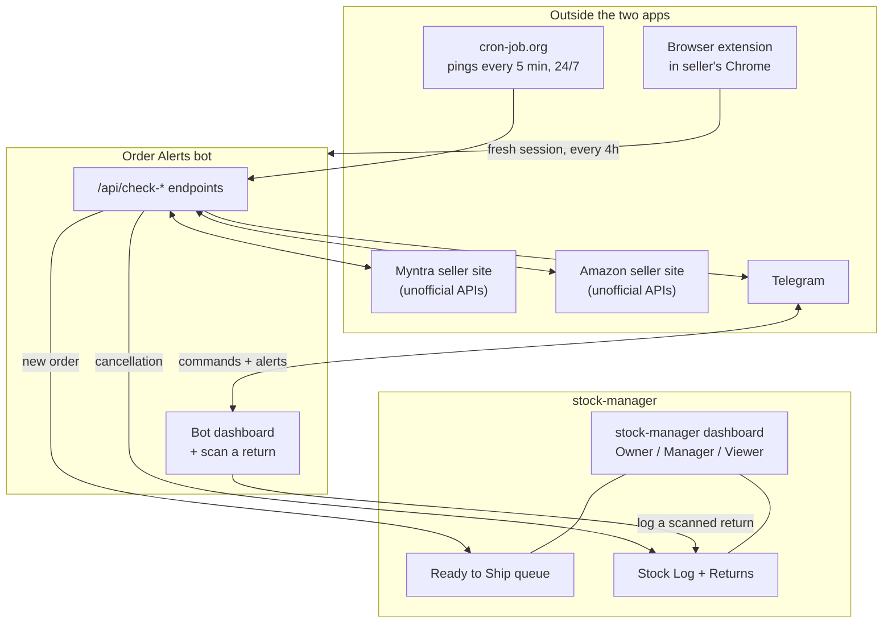
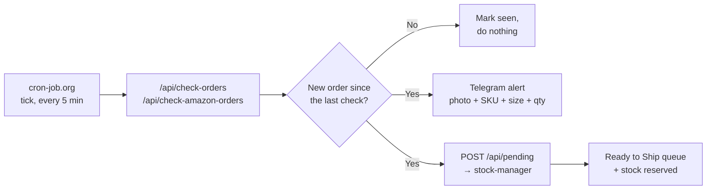
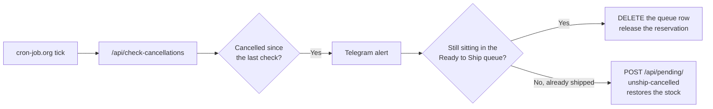
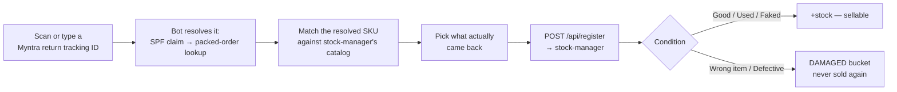
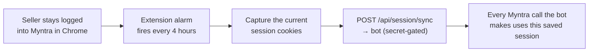

# Rangrooh Order Pipeline

> **Kept in sync with `myntra-order-alert-web` — this exact file lives in both repos.**
> Whenever a change is big enough to affect how orders/alerts/returns actually flow between
> these two apps (a new cron endpoint, a new cross-repo API call, a schedule change, a new
> role/condition, etc.), update **both** copies in the same sitting. `PROJECT.md` in each repo
> is the exhaustive, per-change engineering log; this file is the short, visual "explain this to
> someone" summary — it should stay readable in five minutes, not grow into a second PROJECT.md.
> A rendered, presentable version of this same content also exists as a published Claude
> artifact (ask in a Claude Code session against either repo for the current link).

Two separate apps, one browser extension, and one free external scheduler work together to run
Rangrooh's day-to-day order operations. Neither Myntra nor Amazon gives small sellers an official
API for "tell me the moment something changes" — so this system quietly re-plays the seller's own
logged-in session against their **unofficial** internal endpoints, on a timer, and turns whatever
it finds into a Telegram alert and a stock update.

This file is the map: what each piece owns, and exactly what happens on each of the four things
that actually occur — a new order, a cancellation, a return, and keeping the login alive.

## The cast

| | What it is | Owns |
|---|---|---|
| **Order Alerts bot** (`myntra-order-alert-web`) | Watches Myntra & Amazon, sends Telegram alerts | Detecting orders/cancellations, the Telegram side, the live Myntra/Amazon session |
| **stock-manager** | The source of truth for inventory | Ready to Ship queue, Stock Log, Returns, Products, role-based logins |
| **Browser extension** | Sits in the seller's own Chrome | Quietly re-captures the live Myntra login every few hours |
| **cron-job.org** | A free external scheduler | The thing that actually "ticks" every 5 minutes, 24/7, forever |

**The one rule that holds the whole thing together:** stock-manager is the only place quantities
actually live. The bot never edits stock directly in a database — every stock change goes through
one of stock-manager's own API routes, the exact same ones a person clicking around the dashboard
would trigger.

## Big picture

## Flow: a new order comes in

1. **cron-job.org** fires an HTTP request at the bot's `/api/check-orders` (Myntra) or
   `/api/check-amazon-orders` (Amazon). Both are secret-gated so a stranger can't trigger them.
2. **The bot polls** the marketplace's own unofficial order-list API using the saved session, and
   diffs it against a "seen orders" collection in its own database. Nothing is missed even if a
   check is skipped — the diff always compares against everything ever seen.
3. **If it's new**, a Telegram photo message goes out to whoever's role entitles them to see it,
   and the order's line items (grouped by SKU, quantities summed) are pushed into stock-manager.
   One message per order, even for multi-item orders.
4. **stock-manager reserves stock** for it and it appears in the Ready to Ship queue, ready to be
   packed and marked shipped. This is the one and only way a new order reaches stock-manager —
   nothing else talks to that queue.

## Flow: an order gets cancelled

"Cancelled" can land at two different points in the order's life — before it ever shipped, or
after. Both paths end at the same place: the stock is correct again, either way.

## Flow: scanning and logging a return

This one's the odd-one-out: it runs on demand, not on the cron timer, and it's the one case where
stock-manager's own catalog is *read* by the bot directly — everything else in this system talks
over the API, never the database.

Available from two places that do the exact same thing: the bot's own dashboard (camera or typed
tracking ID, can resolve *and* log in one place) and stock-manager's Returns page (manual pick,
for a return with no Myntra tracking ID to scan).

**Why this needs two lookups chained together:** a return tracking ID alone only gets you a claim
and a reason. Getting the real seller SKU and size means following that claim to the *original*
shipment's own packed-order record — the bot does both automatically instead of a person looking
each one up by hand on Myntra's site.

## Flow: keeping the Myntra login alive

There's no official login API to call instead, so the bot borrows whatever session the seller's
own browser already has — this extension is what keeps that borrowed session from ever going
stale unattended.

## What runs, how often, and why

| What | Runs | Why this rate |
|---|---|---|
| `/api/check-orders` | every 5 min | New Myntra orders — near-real-time without hammering the session |
| `/api/check-amazon-orders` | every 5 min | Same, for Amazon |
| `/api/check-cancellations` | every 5 min | Bounded to recent cancellations only — never re-walks the full history |
| `/api/check-otc` | every 5 min | Only actually *does* anything inside the 12–1pm IST pickup/return window |
| Browser extension sync | every 4 hours | Myntra's session outlives this easily — no need to run it more often |
| Bot dashboard auto-refresh | every 60s, tab open only | Live view for a person watching — never runs when nobody has it open |
| Packed-order count | on demand only | Hits Myntra live — deliberately kept out of any timer, page load or "Refresh" click only |
| stock-manager `/api/backup` | daily, ~2am IST | Full database backup to cloud storage |

cron-job.org is a free external scheduler doing the actual "ticking" — Vercel's own free-tier cron
only fires once a day, far too slow for near-real-time alerts, so an outside service fills that
gap instead.

## Who's allowed to call what

The bot is a server, never a browser, so it can't log in like a person — it carries one shared
secret instead, and stock-manager only recognizes that secret for a short, explicit list of
routes. Everything else on stock-manager needs a real logged-in account.

| Call | Direction | Guarded by |
|---|---|---|
| `POST /api/pending` | Bot → stock-manager | Shared service token |
| `GET /api/pending/check`, `/summary` | Bot → stock-manager | Shared service token |
| `DELETE /api/pending/[id]` | Bot → stock-manager | Shared service token |
| `POST /api/pending/unship-cancelled` | Bot → stock-manager | Shared service token |
| `POST /api/register` | Bot → stock-manager | Shared service token |
| Product / stock catalog reads | Bot → stock-manager's database | Read-only database connection, no writes possible |
| `POST /api/session/sync` | Extension → bot | Separate shared secret |
| Telegram webhook & commands | Telegram → bot | Bot token + per-person role (Owner-only for commands) |
| Bot dashboard itself | Person → bot | Real login — Owner / Viewer accounts (added 2026-09-22); Alert recipients, Role change history and the Team list are Owner-only, enforced server-side too, not just hidden in the UI |
| Everything else on stock-manager | Person → stock-manager | Real login — Owner / Manager / Viewer, section by section |

## Glossary

- **SPF claim** — Myntra's "Seller Protection Fund" record for one returned item — carries the
  return reason and one product photo, keyed by the return's own tracking ID.
- **OTC** — The one-time code Myntra needs at the courier pickup/return window, roughly 12–1pm
  IST daily.
- **Ready to Ship queue** — stock-manager's list of orders that have been detected and reserved
  but not yet physically packed and marked shipped.
- **Condition buckets** — A return is logged as Good, Used, Faked, Wrong item, or Defective. The
  first three go back into sellable stock; the last two are parked in a separate, never-resold
  bucket.
- **Roles — stock-manager** — Owner, Manager, Viewer. Access is granted section by section
  (Returns, Products, Team, …), checked on every page and every API call.
- **Roles — Telegram** — Owner (every alert + can run commands), Viewer (new-order and
  cancellation alerts only), None (nothing at all).
- **Session replay** — The bot's whole approach to talking to Myntra/Amazon: reuse the seller's
  own logged-in browser session against their internal APIs, since no official seller API exists
  for this.
